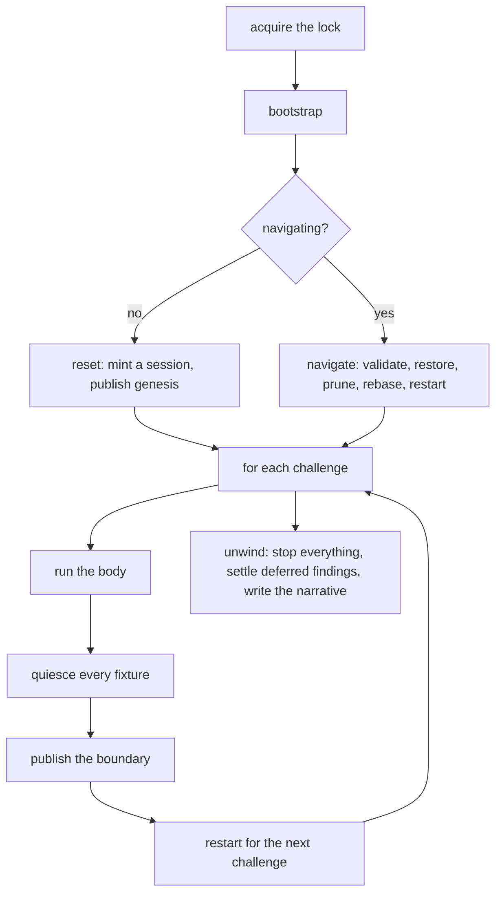

# the engine, the run model, and the two faces

How a gauntlet is composed, sequenced, and reported. With this increment the library is whole: a project defines a corridor, hands it to a face, and gets a verdict.

## composing a gauntlet

```go
challenge.Main(challenge.Gauntlet{
    Name:      "reef",
    WorldHome: suiteDir(),
    Bootstrap: buildReef,
    Challenges: []challenge.Challenge{
        {Name: "estate", Doc: "...", Fn: estate},
        {Name: "containers", Fn: containers},
        {Name: "durability", Fn: durability, NoCheckpoint: true},
    },
})
```

`Name` is the gauntlet's identity and the directory its world lives in. `WorldHome` is the absolute path the tree is anchored beneath — declared, never discovered, because products record absolute paths inside their own state and every face has to land on the same world regardless of where it was invoked from.

`Doc` carries the provenance behind a challenge: the regression it guards, the ordering it depends on, the reason an odd check is there. That knowledge is load-bearing, and it belongs beside the challenge rather than in marginalia — the transcript renders it.

`NoCheckpoint` trades a boundary's save point away. Resume then pays in replay rather than in a full re-run, and the trade is visible in the code at the boundary that made it.

A gauntlet is validated before anything is touched: a challenge with no name, no body, or a name that appears twice is a harness fault. Names are how navigation finds a challenge and how a session records the shape its checkpoints were made against, so a duplicate is not a cosmetic problem.

## the bootstrap

`Bootstrap` is a consumer-owned hook the engine runs once the lock is held and before the world is reset or restored. Core prescribes nothing about what it does — producing the binary under test is the usual job, but no project shape is assumed by the harness. The consumer owns *what*, the engine owns *when*.

The ordering matters: a bootstrap that ran before the lock could rebuild the binary an active run is using, and a later boundary restart would quietly switch that run to different code. Nothing is touched before the lock is held.

The bootstrap gets its own record in the model, so what it did is attributable to it rather than landing on whichever challenge came first.

## the sequence

The lock is held across all of it:



The engine is the only owner of that ordering and the only thing that writes the run model.

Each phase is attributed to what it belongs to. The body and the boundary belong to the challenge that ran: a fixture found dead at the boundary died in that challenge's window, and a snapshot taken there is that challenge's closed world. The **restart** belongs to the challenge about to run — its predecessor's boundary is already published and truthful, so that checkpoint stays, the finding attributes forward, and the upcoming challenge's body is recorded as never having run. Resuming from the retained boundary retries the restart, which is exactly where a debugger wants to return to.

Nothing is restarted after the last challenge, because nothing further will execute.

## navigation

`--from <challenge>` restores the greatest boundary strictly before it, replays whatever lies between, and continues to the end of the corridor. Replay is execution, not a lesser kind of it — where an author traded a save point away, resume pays in replay rather than in a full re-run.

`--only <challenge>` runs one challenge against its immediate predecessor's boundary and nothing else. The rest of the corridor is recorded as *not requested*, which is a different statement from *not reached*.

Both go through the one navigation operation: refuse if an earlier navigation never finished, validate the corridor prefix, resolve the boundary, record the prune intent, restore, clear the abandoned future, rebase the recorded shape, and record the navigation complete.

Every save point carries a manifest — session, boundary, challenge, run — written beside its image when it is published. That manifest is the authority; the directory name is an index for finding and ordering save points and nothing more. Listing reads identity from the manifest and refuses a save point whose name disagrees with it, one that cannot say what it is, or two claiming the same boundary. Restore reads it again rather than trusting the resolution that produced the reference, and navigation checks it against the session's own record of the corridor. A world published at one coordinate can therefore never be presented as another's, however its directory is later labelled.

A resumed run reaches its first challenge through the same bounce a full run does, so the two cannot disagree about the world a challenge starts in.

## the run model

Pure data, written by the engine and walked by every renderer.

A `Run` carries the gauntlet's name, the session identity (the world generation), the run identity (this invocation), the bootstrap's record, one record per challenge, and any findings that belong to no challenge — a refused lock, a gauntlet that will not run, a navigation that will not resolve.

Each `ChallengeRun` carries its status, its steps, its findings, and the boundary it published. The status is about *this invocation only*:

| status | meaning |
|---|---|
| executed | this invocation ran it |
| restored | covered by the restored checkpoint rather than executed here |
| not-run | the invocation ended before reaching it |
| not-requested | the invocation was never asked to run it |

`Verdict()` computes the wire status from the model alone — 0 clean, 1 findings, 2 harness fault — so every renderer reports the same verdict without deriving one of its own.

## sealing

A challenge is not finished when its body returns. Its boundary can still find a fixture dead, cleanup can still settle a wire failure that was waiting to learn what it was, and a report written before either would say `ok` beside a finding the model was about to record.

So a record **seals** when the engine moves focus off it — at which point everything that could add to it has run. The last challenge and any challenge that ended the run seal after cleanup, together with every record the corridor never reached. Renderers walk sealed records only; an unsealed one simply has not happened yet as far as they are concerned.

Adding a step or a finding to a sealed record is a programming error rather than a finding. It means the engine published something as true before it was, which is a bug in the harness rather than a statement about the world under test — so it is refused loudly and recorded at run scope, where the record that was written to too late cannot swallow it.

This is the same move navigation makes: put the honest order in a mechanism rather than in what each call site remembers.

## the renderers

Both are walkers holding no logic. What a finding means, what the verdict is, and which class anything belongs to are all read off the model; a renderer that computed any of that would be a second source of truth able to drift.

The **console reporter** reports each challenge as it completes and a summary at the end.

The **transcript** renders markdown as the run happens: per challenge, its provenance prose, the literal commands, the requests, the findings and their evidence, and the checkpoint it published. It is a projection of execution, generated from the model and never a second source. It is rewritten as each challenge completes, so a failed or aborted run leaves the document that explains it.

Findings render whatever a challenge's status: a challenge that never ran because its fixture would not come back up carries the finding that explains why, and hiding it would leave the not-run unaccounted for.

Attempts accumulate rather than overwrite. A resumed invocation opens a new section against its restored boundary instead of appending silently into the prior narrative, and each attempt's verdict is computed only from its own work — so a clean resume reads clean beside the earlier attempt's finding rather than inheriting it.

## the two faces

**Standalone** is the primary one: the project's suite is its own binary, consumable by `make`, cron, and CI without the `go test` machinery in the way.

```
--from        resume from a named challenge, replaying whatever lies between
--only        run one named challenge against its predecessor's boundary
--list        print the corridor and exit
--clean       discard the world generation and its residue
--world-home  anchor the world somewhere other than the gauntlet's declared home
--transcript  write the narrative somewhere other than beside the world
--verbose     report every step, not only the findings
```

`--world-home` has one owner and is applied before the lock is derived, so the lock, the artifacts, and the world all land together.

The face owns interruption. Children run in their own process groups, so a keyboard interrupt reaches only the harness: provenance is recorded first, the engine's unwind stops everything it started, and the run says it is invalid rather than leaving a live writer behind a released lock. An interrupted run exits 2.

**go test** is the secondary face. It maps the same run onto `testing.T` for IDE integration and unified CI reporting, and it lives behind a build tag in the consumer so `go test ./...` never trips a system suite by accident — unit tests and system tests do not mix by mechanism rather than by convention. It runs the gauntlet whole; navigation belongs to the standalone face alone and stays there.

The invocation that means anything is `go test -count=1 -tags <tag> ...`. The import seam keeps the product's source out of this package's cache key, so without `-count=1` the toolchain can answer `ok (cached)` for a product it never rebuilt and never ran. A cached verdict is no verdict.
